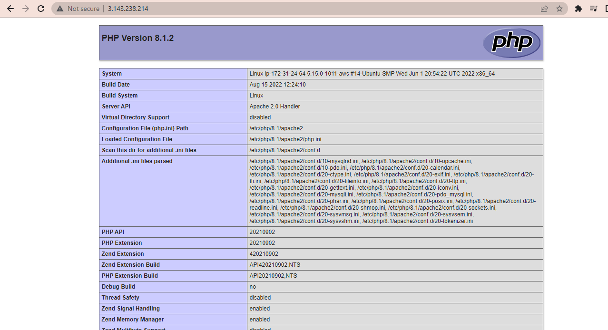

# LAMP STACK IMPLEMENTATION

## Step 1 Install Apache using Ubuntu’s package manager ‘apt’:

- ### updated a list of packages in package manager
```
sudo apt update
```

- Installed Apache2

```
sudo apt install apache2
```

- Verified that apache is running on the OS

```
sudo systemctl status apache2
```


*the image above shows that the apache web server is active*

- Opened TCP port 80 in my EC2 security group

- Access the public IP adress from a web browser


*the image above shows the apache from a web server*

## step 2. Installing a Database (MySQL)
- installing MySQL apt
```
sudo apt install mysql-server
```
- Connecting MySQL as the administrative database
```
sudo mysql
```

*MySQL ouput*

- Setting up a password for MySQL root user
```
ALTER USER 'root'@'localhost' IDENTIFIED WITH mysql_native_password BY 'PassWord.1';
```
- Exit the MySQL shell

```
mysql> exit
```

- Start the interactive script by running
```
sudo mysql_secure_installation
```


- Testing login
```
sudo mysql -p
```
- login


*successful of password*
## STEP 3 — Installing PHP
- install these 3 (php, php-mysql,libapache2-mod-php) packages at once
```
sudo apt install php libapache2-mod-php php-mysql
```
- Confirming the PHP version
```
php -v
```

*The image above shows the version of PHP installed*
## Creating a virtual host for website using Apache
- Create the directory for projectlamp using ‘mkdir’ command
```
sudo mkdir /var/www/projectlamp
```
- Assign ownership of the directory with current system user
```
 sudo chown -R $USER:$USER /var/www/projectlamp
 ```
- create and open a new configuration file in Apache’s sites-available directory using your preferred command-line editor (vi or vim)
```
sudo vi /etc/apache2/sites-available/projectlamp.conf
```
- The above code created a new blank file so i pasted the text below and saved it then closed the file
```
<VirtualHost *:80>
    ServerName projectlamp
    ServerAlias www.projectlamp 
    ServerAdmin webmaster@localhost
    DocumentRoot /var/www/projectlamp
    ErrorLog ${APACHE_LOG_DIR}/error.log
    CustomLog ${APACHE_LOG_DIR}/access.log combined
</VirtualHost>
```

- To save and close the file, simply follow the steps below:

Hit the esc button on the keyboard

Type :

Type wq. w for write and q for quit

Hit ENTER to save the file

- Showing the new file in the sites-available directory
```
sudo ls /etc/apache2/sites-available
```
- Using a2ensite command to enable the new virtual host
```
sudo a2ensite projectlamp
```
- To disable Apache’s default website use a2dissite command 
```
sudo a2dissite 000-default
```
- To make sure your configuration file doesn’t contain syntax errors
```
sudo apache2ctl configtest
```
- Reload Apache so these changes take effect:
```
sudo systemctl reload apache2
```
 - Create an index.html file in that location so that we can test that the virtual host works as expected
```
sudo echo 'Hello LAMP from hostname' $(curl -s http://169.254.169.254/latest/meta-data/public-hostname) 'with public IP' $(curl -s http://169.254.169.254/latest/meta-data/public-ipv4) > /var/www/projectlamp/index.html```
```

*The output shows that the Apache virtual host is working as expected.*

 ## Step 5 - Enable PHP on the Website
 - Changing the behaviour in a file
  ```
  sudo vim /etc/apache2/mods-enabled/dir.conf
  ```
  ```
  <IfModule mod_dir.c>
        #Change this:
        #DirectoryIndex index.html index.cgi index.pl index.php index.xhtml index.htm
        #To this:
        DirectoryIndex index.php index.html index.cgi index.pl index.xhtml index.htm
</IfModule>
```
- Reload the the Apache
```
sudo systemctl reload apache2  
```
- Creating a new PHP file
```
sudo systemctl reload apache2
```
- Linking a PHP code to the file
```
<?php
phpinfo();
```
- Removing information on the PHP server
``` 
sudo rm /var/www/projectlamp/index.php
```

*The image above shows the end result of our website*

